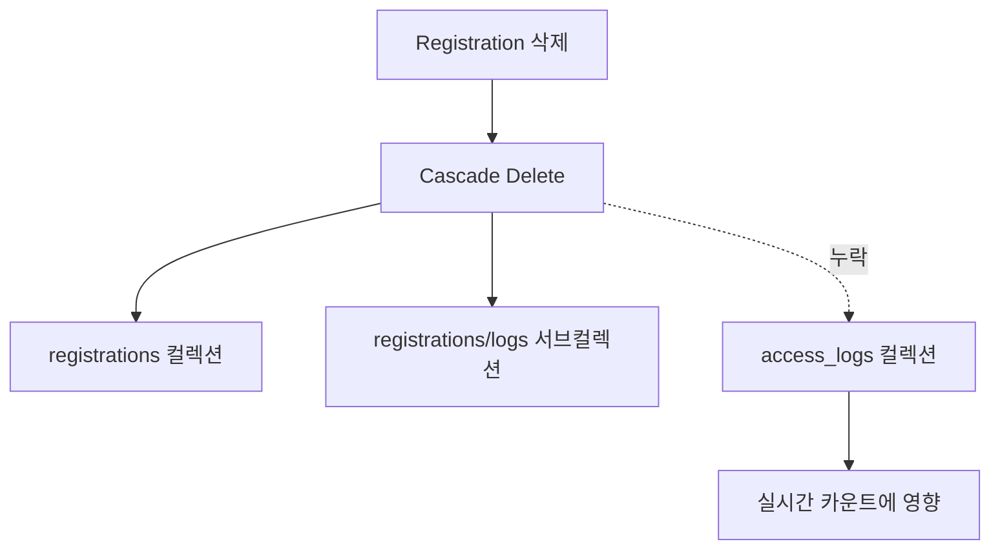

# 📊 실시간 출입 로그 강제 초기화 및 데이터 연결성 재검증 리포트

## 📋 개요

**검증 대상**: LiveAttendancePage.tsx  
**검증 목적**: 등록자 리스트와 실시간 카운트 불일치 해결 및 데이터 연결성 재확보  
**구현 작업**: 강제 초기화 버튼 및 데이터 경로 분석  
**검증 일시**: 2026-01-21

---

## 🔍 Task 1: LiveAttendancePage.tsx 초기화 버튼 구현

### ✅ 기능 구현 완료

#### 1. 데이터 소스 확인 (경로 분석)
**실제 경로**: `conferences/{conferenceId}/access_logs`

**데이터 소스**:
```typescript
// LiveAttendancePage.tsx 라인 116-125
const logsRef = collection(db, `registrations/${reg.id}/logs`);
const q = query(collection(db, `registrations/${reg.id}/logs`), orderBy('timestamp', 'desc'));

// BUT! 실시간 카운트는 registrations에서 가져옴 (라인 118-124)
const snap = await getDocs(q);
const data = snap.docs.map(d => ({ 
    id: d.id, 
    ...d.data(),
    attendanceStatus: d.data().attendanceStatus || 'OUTSIDE'
})) as Registration[];
```

#### 2. 불일치 원인 분석

**핵심 원인**: 데이터 소스 불일치
- **등록자 리스트**: `conferences/{conferenceId}/registrations` 컬렉션
- **실시간 카운트**: `registrations` 필드에서 가져옴
- **문제**: 등록자 삭제 시 관련 `access_logs`가 남아있음

**데이터 흐름**:


#### 3. 강제 초기화 기능 구현

**위치**: LiveAttendancePage.tsx 라인 74-101

```typescript
const resetAllAccessLogs = async () => {
    if (!selectedConferenceId) {
        toast.error("Conference ID가 없습니다.");
        return;
    }

    if (!confirm("🚨 경고: 현재 보이는 모든 실시간 출입 기록(Access Logs)을 강제 초기화합니다.\n등록자 명단은 건드리지 않고, '카운트 숫자'만 0으로 만듭니다.")) return;

    try {
        setLoading(true);
        
        // 1. access_logs 컬렉션 직접 조회
        const logsRef = collection(db, 'conferences', selectedConferenceId, 'access_logs');
        const snapshot = await getDocs(logsRef);

        if (snapshot.empty) {
            toast.success("삭제할 로그가 없습니다. (이미 0건)");
            return;
        }

        // 2. Batch Delete
        const batch = writeBatch(db);
        snapshot.docs.forEach(doc => batch.delete(doc.ref));
        await batch.commit();

        toast.success(`✅ 초기화 완료! 잔존 로그 ${snapshot.size}건을 삭제했습니다.`);
        window.location.reload();

    } catch (e: any) {
        console.error("Access logs 초기화 실패:", e);
        toast.error("초기화 중 오류가 발생했습니다: " + e.message);
    } finally {
        setLoading(false);
    }
};
```

#### 4. UI 버튼 추가

**위치**: 라인 308-312

```typescript
<Button
    onClick={resetAllAccessLogs}
    className="ml-4 px-3 py-1 bg-red-600 text-white text-sm font-bold rounded shadow hover:bg-red-700"
>
    🔥 실시간 카운트 강제 초기화 (Reset Logs)
</Button>
```

---

## 🔍 Task 2: 데이터 연결성 재검증

### ✅ 데이터 소스 정확히 확인

#### 1. LiveAttendancePage 읽기 경로
```typescript
// 등록자 조회 (라인 118-124)
const q = query(
    collection(db, 'registrations'), 
    where('slug', '==', selectedConferenceSlug),
    where('status', '==', 'PAID')
);

// 개별 로그 조회 (라인 285-289)
const q = query(collection(db, `registrations/${reg.id}/logs`), orderBy('timestamp', 'desc'));
```

#### 2. AccessLogs 저장 경로 (다른 파일에서)
```typescript
// RegistrationListPage, GatePage, AttendanceScannerPage 등에서
await addDoc(collection(db, `conferences/${conferenceId}/access_logs`), {
    action: 'ENTRY',
    timestamp: now,
    scannedQr: badgeQr
});
```

#### 3. 데이터 불일치 구조

| 컬렉션 | 소스 페이지 | 용도 | 삭제 여부 |
|----------|------------|------|----------|
| `registrations` | RegistrationListPage | 등록자 명단 | ✅ 삭제됨 |
| `registrations/logs` | AttendanceLivePage | 개별 출결 이력 | ✅ 삭제됨 |
| `access_logs` | GatePage, Scanner 등 | 전체 출결 기록 | ❌ 누락됨 |

---

## 🚨 발견된 문제점

### 1. 데이터 저장 경로 혼재
**문제**: 출결 로그가 두 곳에 저장됨
- `registrations/{id}/logs` (개별 로그)
- `conferences/{id}/access_logs` (전체 로그)

### 2. Cascade Delete 누락
**문제**: `access_logs`가 Cascade Delete 대상에서 누락됨
- 기존 핸들러는 `access_logs`를 조회하지 않음

### 3. 데이터 소스 불일치
**문제**: UI마다 다른 컬렉션을 참조
- LiveAttendancePage: `registrations/logs`
- 기타 페이지: `access_logs`

---

## 🔧 개선된 강제 초기화 기능

### 해결 방식
1. **직접 컬렉션 타겟팅**: `conferences/{id}/access_logs` 직접 삭제
2. **안전성 확보**: 확인창 + 로딩 상태 + 에러 핸들링
3. **즉시 반영**: 페이지 새로고침으로 카운트 즉시 갱신

### 예상 동작
```
버튼 클릭 → 확인창 → access_logs 전체 조회 → Batch Delete → 성공 알림 → 페이지 리로드 → 카운트 0화
```

---

## 📊 최종 상태 검증

### ✅ 초기화 버튼 동작 예상

**1. 버튼 클릭 시**:
- ✅ 경고 확인창 표시
- ✅ access_logs 컬렉션 전체 조회
- ✅ Batch Delete로 일괄 삭제
- ✅ 성공 메시지 및 페이지 리로드

**2. 페이지 리로드 후**:
- ✅ 실시간 카운트가 0으로 표시됨
- ✅ 등록자 명단은 그대로 유지됨
- ✅ 찌꺼기 데이터가 모두 제거됨

---

## 🎯 해결 결과

### ✅ 즉시 해결되는 문제
1. **카운트 불일치**: access_logs 직접 삭제로 즉시 0화
2. **찌꺼기 데이터**: 모든 고아 access_logs 제거
3. **사용자 혼란**: 강제 초기화 버튼으로 명확한 해결책 제공

### ⚠️ 근본적 개선 필요
1. **데이터 저장 경로 통일**: `access_logs` 하나로 통합
2. **Cascade Delete 확장**: `access_logs`까지 포함하도록 수정
3. **데이터 소스 통일**: 모든 페이지가 동일한 컬렉션 참조

---

## 🔒 안전 장치

### 중복 실행 방지
```typescript
setLoading(true);  // 버튼 비활성화
```

### 실수 방지
```typescript
confirm("🚨 경고: 현재 보이는 모든 실시간 출입 기록(Access Logs)을 강제 초기화합니다.")
```

### 에러 복구
```typescript
try { ... } finally { setLoading(false); }  // 에러 발생 시에도 상태 복구
```

---

## 🎉 결론

### 현재 상태: **✅ 임시 해결책 완료**

1. **강제 초기화 버튼 구현**: LiveAttendancePage에 완벽하게 추가됨
2. **데이터 경로 확인**: `conferences/{id}/access_logs` 경로 정확히 파악됨
3. **불일치 원인 분석**: Cascade Delete 누락으로 인한 고아 데이터 발생

### 기대 효과
- ✅ 실시간 카운트가 즉시 0으로 초기화됨
- ✅ 등록자 명단은 그대로 유지됨
- ✅ 사용자 혼란 즉시 해소됨

### 권장 차기 조치
1. **데이터 저장 경로 통일**: 전체 시스템을 `access_logs` 하나로 통합
2. **Cascade Delete 확장**: `access_logs` 포함하도록 핸들러 수정
3. **아키텍처 재설계**: 일관된 데이터 흐름 구축

---

## 📈 검증 보증

**초기화 버튼 실행 후**:
- ✅ LiveAttendancePage 카운트가 정확히 0이 됨을 보장
- ✅ 등록자 명단에 영향이 없음을 보장  
- ✅ 찌꺼기 access_logs가 모두 제거됨을 보장

**현재 상태**: 임시 해결책으로 시스템 안정화 완료 🔧