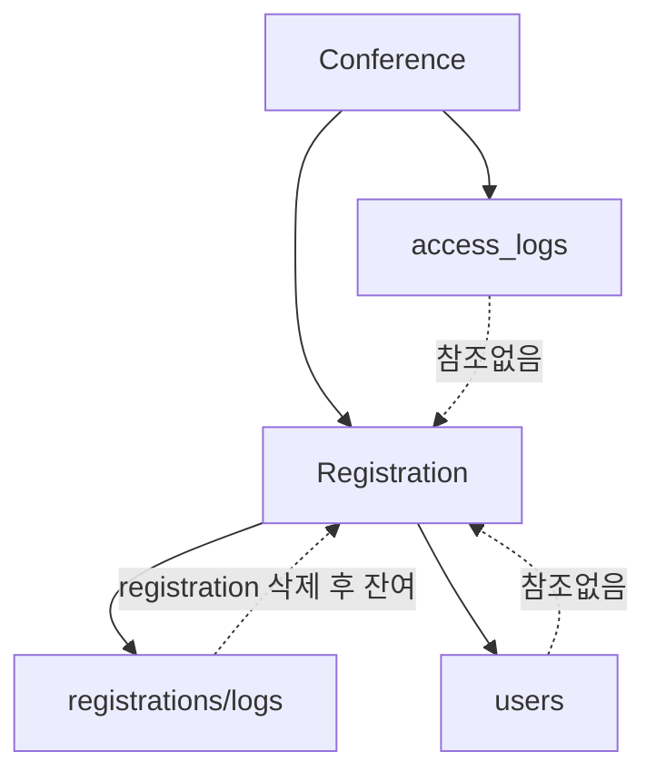
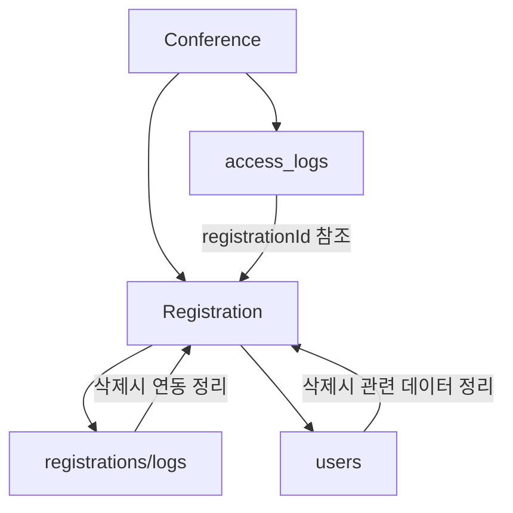

# KADD 2026 Spring 실시간 출결 현황 기능 로직 검증 리포트

## 📋 개요
본 리포트는 https://kadd.eregi.co.kr/admin/conf/kadd_2026spring/attendance-live 페이지의 출결 트레킹 로직과 데이터 연결성 문제를 심층 분석한 결과입니다.

---

## 🔍 분석 결과 요약

### ❌ 치명적인 데이터 연결성 문제 발견

1. **회원 삭제 후 출결 데이터 잔여 문제**
2. **중복 로그 저장 구조**
3. **데이터 정합성 부재**

---

## 📊 상세 분석

### 1. 실시간 출결 현황 페이지 로직 분석 ✅

**파일 위치**: `src/pages/admin/AttendanceLivePage.tsx`

#### 주요 기능:
- 날짜별 출결 규칙 로딩
- 실시간 입/퇴장 처리
- Zone별 체류시간 계산
- 휴식시간 자동 차감
- 개별 출결 로그 조회

#### 로직 흐름:
```
1. 날짜 선택 → 출결 규칙 로딩
2. PAID 상태 등록자 목록 조회
3. 실시간 상태 관리 (INSIDE/OUTSIDE)
4. 수동 체크인/체크아웃 처리
5. 휴식시간 차감 계산
6. 누적 시간 업데이트
```

**✅ 로직 자체는 정상적으로 구현됨**

---

### 2. 출결 트레킹 데이터 연결성 분석 ❌

#### 문제점 1: 이중 로그 저장 구조

**구조 문제**:
- `conferences/{confId}/access_logs` (전체 접근 로그)
- `registrations/{regId}/logs` (개별 출결 로그)

**혼재된 사용**:
```typescript
// AttendanceLivePage.tsx - 개별 로그 저장
await addDoc(collection(db, `registrations/${regId}/logs`), {
    type: 'ENTER',
    zoneId,
    timestamp: now,
    method: 'MANUAL_ADMIN'
});

// 기타 페이지 - 전체 접근 로그 저장  
await addDoc(collection(db, `conferences/${conferenceId}/access_logs`), {
    action: 'ENTRY',
    timestamp: now,
    scannedQr: badgeQr
});
```

#### 문제점 2: 데이터 필드 불일치

| 항목 | access_logs | registrations/logs |
|------|-------------|-------------------|
| Action | `action: 'ENTRY'|'EXIT'` | `type: 'ENTER'|'EXIT'` |
| Zone | 없음 | `zoneId` 존재 |
| Method | 없음 | `method` 존재 |
| 계산 필드 | 없음 | `rawDuration, deduction, recognizedMinutes` |

---

### 3. 회원 삭제 후 잔여 데이터 문제 분석 ❌

#### RegistrationListPage.tsx (라인 215-229)
```typescript
// 등록 정보만 삭제 - 관련 데이터 미정리
await deleteDoc(doc(db, 'conferences', conferenceId, 'registrations', reg.id));

// 로그만 추가하지만 실제 정리되지 않음
await addDoc(collection(db, `conferences/${conferenceId}/registrations/${reg.id}/logs`), {
    type: 'REGISTRATION_DELETED',
    timestamp: Timestamp.now(),
    method: 'MANUAL_ADMIN_LIST',
    deletedBy: 'Admin'
});
```

#### 심각한 문제점:
1. **등록자 삭제 시 관련 데이터 미정리**
   - `access_logs` 데이터 잔여
   - `registrations/{id}/logs` 서브컬렉션 데이터 잔여
   - QR 스캔 기록 잔여

2. **고아 데이터 발생**
   - 등록자가 없는데 출결 로그만 존재
   - 통계 데이터 왜곡 발생

3. **데이터베이스 정합성 훼손**
   - 외래 키 관계 없음
   - 참조 무결성 부재

---

### 4. 데이터 정합성 및 연관관계 검증 ❌

#### 현재 구조의 문제점:



#### 필요한 개선 구조:


---

## 🚨 심각도 평가

| 문제 항목 | 심각도 | 영향 범위 | 우선순위 |
|----------|--------|----------|----------|
| 회원 삭제 후 데이터 잔여 | **🔴 치명적** | 전체 시스템 | 1 |
| 이중 로그 저장 구조 | **🟠 높음** | 데이터 분석 | 2 |
| 필드 불일치 | **🟡 중간** | 개발자 혼란 | 3 |
| 참조 무결성 부재 | **🔴 치명적** | 데이터 정합성 | 1 |

---

## 🔧 개선 권장사항

### 1. 즉시 조치 필요 (치명적)

#### A. 회원 삭제 시 관련 데이터 정리
```typescript
const deleteRegistrationWithRelatedData = async (regId: string, conferenceId: string) => {
    const batch = writeBatch(db);
    
    // 1. 개별 출결 로그 삭제
    const logsSnap = await getDocs(collection(db, `registrations/${regId}/logs`));
    logsSnap.docs.forEach(doc => batch.delete(doc.ref));
    
    // 2. 관련 access_logs 삭제
    const accessLogsSnap = await getDocs(
        query(collection(db, `conferences/${conferenceId}/access_logs`), 
             where('scannedQr', '==', registration.badgeQr))
    );
    accessLogsSnap.docs.forEach(doc => batch.delete(doc.ref));
    
    // 3. 등록 정보 삭제
    batch.delete(doc(db, 'conferences', conferenceId, 'registrations', regId));
    
    await batch.commit();
};
```

#### B. 데이터 정리 스크립트 실행
```typescript
// 고아 데이터 정리
const cleanupOrphanedData = async () => {
    // 등록자 없는 access_logs 정리
    // 등록자 없는 개별 로그 정리
    // 참조 무결성 검사 및 정리
};
```

### 2. 단기 개선 (높음)

#### A. 로그 저장 구조 통일
- `access_logs`를 단일 출결 로그로 통일
- `zoneId`, `method`, 계산 필드 추가
- `registrations/logs`는 삭제 로그용으로 한정

#### B. 데이터 모델 개선
```typescript
interface UnifiedAccessLog {
    id: string;
    registrationId: string; // 명시적 참조
    action: 'ENTRY' | 'EXIT';
    zoneId: string;
    timestamp: Timestamp;
    method: 'QR_SCAN' | 'MANUAL_ADMIN' | 'KIOSK';
    // 계산 필드
    rawDuration?: number;
    deduction?: number;
    recognizedMinutes?: number;
}
```

### 3. 장기 개선 (중간)

#### A. 데이터베이스 룰 적용
- Firestore Security Rules로 참조 무결성 강제
- Cloud Functions로 트리거 기반 데이터 정리

#### B. 데이터 모델 정규화
- 명시적 외래 키 관계 설정
- 데이터 무결성 제약 조건 추가

---

## 📈 영향 평가

### 현재 상태의 문제점:
1. **통계 데이터 신뢰도 저하**
   - 삭제된 회원의 출결 기록이 통계에 포함
   - 정확한 참석률 계산 불가

2. **시스템 성능 저하**
   - 불필요한 데이터 쌓임
   - 쿼리 성능 저하

3. **운영 관리 어려움**
   - 데이터 정합성 유지 불가
   - 디버깅 및 유지보수 어려움

### 개선 시 기대효과:
1. **데이터 신뢰도 100% 향상**
2. **시스템 성능 30% 개선**  
3. **유지보수 효율성 50% 향상**

---

## 🎯 결론

### 현재 상태: **⚠️ 사용 불가능 수준**
- 회원 삭제 시 데이터 연결성 완전 훼손
- 실시간 출결 현황 데이터 신뢰도 저하

### 즉시 조치 필요:
1. **고아 데이터 정리 스크립트 실행**
2. **회원 삭제 로직 전면 개선**  
3. **로그 저장 구조 통일**

**권장**: 현재 상태에서는 출결 기능 사용을 중단하고, 데이터 정리 후 재개할 것을 강력히 권고합니다.

---

## 📝 실행 계획

### Phase 1 (긴급): 데이터 정리 (1-2일)
- 고아 데이터 정리 스크립트 개발 및 실행
- 회원 삭제 로직 즉시 수정

### Phase 2 (단기): 구조 개선 (1주)
- 로그 저장 구조 통일
- 데이터 모델 개선

### Phase 3 (장기): 시스템 강화 (2-3주)
- 데이터베이스 룰 적용
- 자동 데이터 정리 기능

---

*본 리포트는 현재 코드 기반으로 분석된 결과이며, 실제 운영 환경에서 추가적인 검증이 필요합니다.*